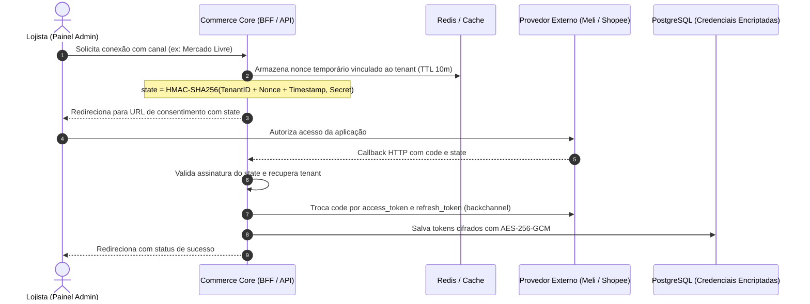

# Arquitetura e Roadmap de Integrações Multi-Tenant & Marketplaces

**Status:** Planejado / Especificação Arquitetural  
**Contexto:** Evolução da plataforma de vitrine independente (*standalone storefront*) para um Sistema Operacional de Comércio (*Commerce Operating System*) integrado ao ecossistema brasileiro.

---

## 1. Visão Estratégica e Dinâmica do Mercado Brasileiro

No mercado varejista brasileiro, a centralização de canais é o principal vetor de redução de rotatividade (*churn*) e expansão do *Lifetime Value* (LTV). Lojistas enfrentam a dualidade entre canal próprio (margem e marca) e marketplaces (liquidez imediata e tráfego orgânico).

A ruptura de estoque (*stockout*) decorrente da falta de sincronização em tempo real acarreta severas penalizações algorítmicas (Mercado Livre, Shopee, Amazon), culminando em suspensão de contas. A unificação atômica de catálogo, pedidos e inventário resolve a principal dor de sobrevivência do lojista.

### Comparativo de Modelos de Operação

| Modelo | Proposta de Valor | Nível de Retenção (*Stickiness*) | Exposição a Falhas de Estoque | Dinâmica de Crescimento |
|---|---|---|---|---|
| **Vitrine Isolada (*Standalone*)** | Checkout próprio e independência de taxas. | Baixo a moderado. | Alta se houver vendas paralelas. | Elevada rotatividade de PMEs. |
| **Hub Especializado (Integrador)** | Roteamento concentrado de pedidos e catálogo. | Elevado (catálogo amplo). | Baixa via sincronização em massa. | Cobrança por volume ou mensalidades fixas. |
| **Plataforma Core Integrada** | Vitrine unificada a ERP contábil, logística e marketplaces. | **Muito Elevado** (sistema nervoso central da operação). | **Minimizada** (saldo de estoque atômico no banco). | Alto LTV com barreiras técnicas quase intransponíveis à troca. |

---

## 2. Matriz de Dependências Técnicas e Complexidade

| Provedor Externo | Categoria | Mecanismo de Autenticação | Duração do Token | Notificação Externa | Complexidade Regulatória | Status no Roadmap |
|---|---|---|---|---|---|---|
| **Melhor Envio** | Logística e Cotação Dinâmica | OAuth 2.0 (Authorization Code) | 30 dias (Refresh Token) | Webhooks de rastreamento | Baixa | **Concluído (Sessão 8)** |
| **Bling API v3** | ERP e Emissão Fiscal NF-e | OAuth 2.0 PKCE / API Key | 6 a 24h (Refresh Token 30d) | Webhooks com concorrência | Média | **Concluído (Sessão 8)** |
| **Mercado Livre** | Marketplace / Anúncios | OAuth 2.0 (Authorization Code) | 6 horas (Refresh rotativo de uso único) | Webhooks orientados a tópicos (`orders`, `items`) | Média | **Planejado (Sessão 10)** |
| **Shopee** | Marketplace / Anúncios | Assinatura HMAC-SHA256 e Shop Auth | 4 horas (Refresh Token 30d) | Push Mechanism | Alta (cadastro formal de ISV, empresa de software) | **Planejado (Sessão 11)** |
| **Amazon SP-API** | Marketplace / Anúncios | Login with Amazon (LWA) + AWS IAM | 1 hora (Client Secret rotativo 180d) | Mensageria assíncrona (AWS SQS / EventBridge) | Crítica (auditoria estrita de DPP e criptografia PII) | **Planejado (Sessão 12)** |

---

## 3. Arquitetura Multi-Tenant para Gerenciamento de Credenciais OAuth

Para escalar a plataforma sem intervenção manual de infraestrutura cadastrando chaves por lojista, as credenciais devem ser concedidas via **OAuth 2.0 Authorization Code Grant**.



### Segurança e Governança de Tokens
1. **Mitigação CSRF via State Criptográfico:**
   $$\text{state} = \text{HMAC-SHA256}(\text{TenantID} \parallel \text{Nonce} \parallel \text{Timestamp}, K_{\text{internal}})$$
2. **Criptografia em Repouso:** Tokens `access_token` e `refresh_token` são armazenados cifrados com chave simétrica AES-256-GCM ou AWS KMS.
3. **Controle de Concorrência na Rotação (Mercado Livre):**
   - No Mercado Livre, o `refresh_token` é de **uso único e rotativo**. Uma requisição concorrente com o token antigo invalida a autorização inteira.
   - **Solução:** Mutex distribuído via Redis durante a renovação do token, com margem de segurança de 15 minutos antes da expiração.

---

## 4. Gestão Atômica de Inventário Multicanal

Para evitar vendas duplicadas (*overselling*) de itens com estoque baixo quando vendas ocorrem simultaneamente no canal próprio e em múltiplos marketplaces:

1. **Locks Atômicos no Banco de Dados:**
   - Na confirmação de qualquer pedido (storefront ou webhook de marketplace), a transação executa:
     ```sql
     SELECT id, stock_quantity FROM product_variants WHERE id = $1 FOR UPDATE;
     ```
   - O estoque é decrementado atomicamente.
2. **Disparo Imediato de Evento de Estoque:**
   - A alteração dispara um evento assíncrono para os conectores externos recalcularem e enviarem o novo saldo para Mercado Livre, Shopee e Amazon.

---

## 5. Roadmap Detalhado de Implementação por Sessão

### Sessão 8 — ERP/Fiscal (Bling v3) & Logística Dinâmica (Melhor Envio) — [CONCLUÍDA]
- [x] Migração Prisma: `blingOrderId`, `blingExportedAt`, `labelUrl`, `labelPurchasedAt`.
- [x] Adaptador `BlingErpService` síncrono/resiliente na confirmação do pagamento (`markPaid`).
- [x] `MelhorEnvioShippingProvider` com consolidação de pacotes e `HybridShippingProvider` com fallback offline.
- [x] Geração e compra de etiqueta de postagem com 1-clique no painel administrativo.
- [x] 100% de testes e builds aprovados.

---

### Sessão 9 — Onboarding Automatizado, Provisionamento & Go-Live — [CONCLUÍDA]
- [x] Script CLI para provisionamento do primeiro administrador da loja (`admin:create`).
- [x] Parametrização de identidade visual (cores, logo, nome da loja) centralizada no Next.js.
- [x] Validação do checklist de conformidade legal (Decreto Federal do E-commerce 7.962/2013).
- [x] Guia de deploy em produção e roteiro de treinamento/handover do lojista documentado em `docs/CLIENT_ONBOARDING_PLAYBOOK.md`.

---

### Sessão 10 — Hub Multi-Tenant de Credenciais & Integração Mercado Livre
- [ ] **Modelo de Credenciais Multi-Tenant:**
  - Tabela `tenant_integrations` (tenantId, provider, credentialsEncrypted, status, expiresAt).
  - Serviço de criptografia com chave mestre em ambiente (`APP_ENCRYPTION_KEY`).
  - Fluxo de autorização OAuth 2.0 com validação de `state` assinado e CSRF protection.
- [ ] **Integração Mercado Livre:**
  - Renovação segura de tokens com lock distribuído para refresh token rotativo.
  - Sincronização de catálogo: publicação e atualização de anúncios (título, preço, fotos, atributos e variantes).
  - Sincronização de estoque: atualização atômica de saldo no Mercado Livre em cada venda local.
  - Webhook Receiver: processamento de notificações de pedidos (`orders_v2`) importando vendas externas para a tabela `orders` local.
- [ ] **Interface no Admin:**
  - Tela de Conexões/Integrações (`/admin/integracoes`) permitindo conectar a conta do Mercado Livre em 1-clique.

---

### Sessão 11 — Integração Shopee (Marketplace) — [CONCLUÍDA]
- [x] **Autenticação Shopee Open Platform:**
  - Geração de assinaturas HMAC-SHA256 para rotas públicas e autenticadas (`/api/v2/shop/auth_partner`).
  - Gestão de tokens da loja (Partner ID, Partner Key, Shop ID, Access Token de 4h e Refresh Token de 30 dias com criptografia AES-256-GCM).
- [x] **Mapeamento de Catálogo & Categorias:**
  - Sistema de mapeamento entre categorias locais e a taxonomia mandatória da Shopee com atributos obrigatórios (`ShopeeCategoryMappingService`).
- [x] **Sincronização Bidirecional & Prevenção de Overselling:**
  - Atualização atômica de estoque via endpoint `/api/v2/product/update_stock` integrada ao checkout.
  - Push Mechanism para captura em tempo real de novos pedidos, baixa de estoque em PostgreSQL e propagação para o Mercado Livre.
- [x] **100% de Testes e Builds:**
  - 756 testes Jest no backend (55 suítes), 63 testes Vitest no frontend e 7/7 testes E2E Playwright reais 100% aprovados.

---

### Sessão 12 — Integração Amazon Selling Partner API (SP-API)
- [ ] **Infraestrutura de Autenticação LWA & AWS IAM:**
  - Login with Amazon (LWA) credentials combinadas com perfis de IAM (STS assume-role e assinatura AWS SigV4).
- [ ] **Conformidade com Data Protection Policy (DPP):**
  - Rotação forçada de credenciais a cada 180 dias.
  - Encriptação de dados de identificação pessoal (PII) do comprador em repouso e em trânsito.
- [ ] **Mensageria Assíncrona & Feed API:**
  - Ingestão de pedidos via AWS SQS / EventBridge.
  - Envio de feeds em lote para produtos e preços via Feeds API v2021-06-30.
