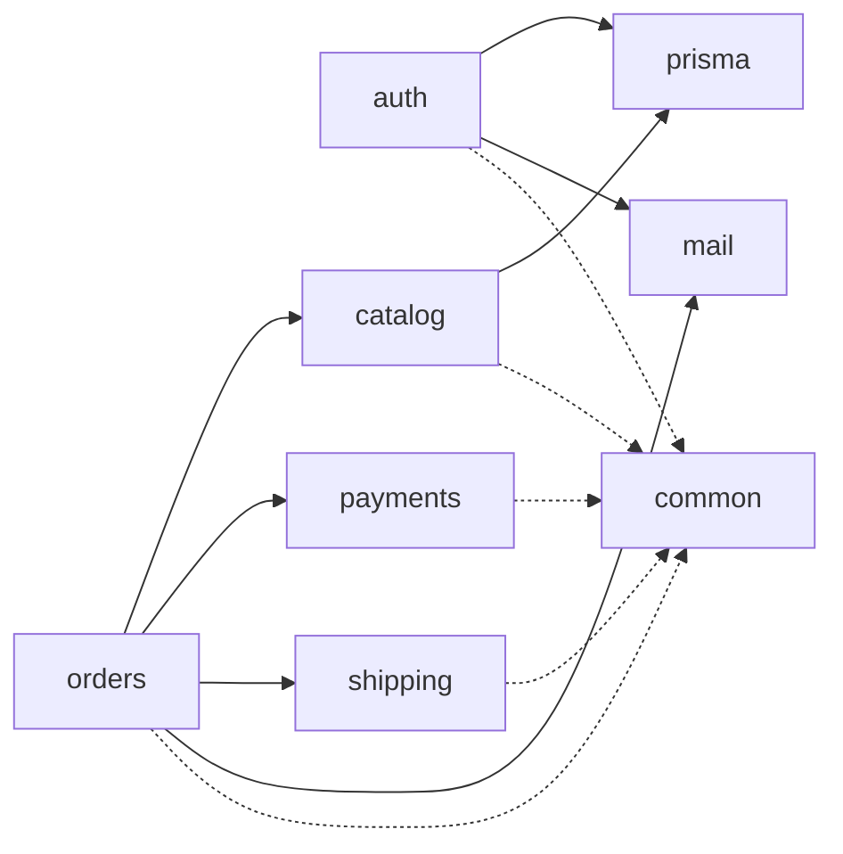

# Mapa de módulos internos

> Status: real, inteiro. `auth`, `catalog`, `orders`, `payments` (Stripe
> de verdade), `shipping` (tabela de frete por faixa de CEP), `prisma` e
> `mail` existem, e as quatro setas que saem de `orders` são código. Se um
> módulo passar a depender de outro de um jeito não previsto aqui, o
> diagrama está desatualizado, não o código.

Setas sólidas = depende de (chamada direta via interface/serviço
injetado). Setas tracejadas = usa utilitário compartilhado, sem
acoplamento de domínio.

## Regras de dependência

- `orders` é o orquestrador: conhece `catalog` (checar produto/estoque),
  `payments` (cobrar), `shipping` (calcular frete) e `mail` (avisar o
  cliente do que aconteceu com o pedido). Nenhum desses quatro conhece
  `orders` de volta — o que cruza a fronteira do `mail` é um view model do
  próprio `mail` (`OrderEmailData`), montado aqui. O contrato do lado de `catalog`
  está em uso: `CatalogModule` exporta `ProductsService` (`findByIds`,
  a leitura em lote do que está sendo comprado, e por onde o peso do
  produto chega ao frete) e `StockService`
  (`decrement`, o UPDATE condicional atômico do checkout, e `restock`,
  a devolução do cancelamento — ambos aceitam um client de transação
  pro checkout/cancelamento serem atômicos através da fronteira) —
  `orders` nunca toca nas tabelas do catálogo.
- `catalog`, `payments` e `shipping` não se conhecem entre si.
- `auth` não depende de nenhum módulo de domínio. Os outros módulos
  usam `auth` só através de decorators (`@Public()`,
  `@RequirePermissions(...)`, `@CurrentUser()`) e do
  `OptionalJwtAuthGuard` (rota pública que enxerga mais quando o caller
  prova quem é — caso das leituras do catálogo), nunca importando
  serviços internos de `auth` diretamente — por isso não aparece como
  seta sólida saindo deles.
- `prisma` é infraestrutura, não domínio: expõe `PrismaService` como
  módulo global. `auth` depende dele de verdade (seta sólida) — lê
  usuário, papel e refresh token — e `catalog` também (produtos,
  categorias, estoque); ele não conhece ninguém de volta.
- `mail` é infraestrutura também: expõe uma interface (`MailService`) via
  token, com o adapter do Resend escondido atrás — mesmo padrão de
  `payments`/`shipping`. `auth` depende dela pra verificação de e-mail e
  reset de senha; `orders` pros e-mails do ciclo de vida do pedido
  (`docs/specs/order-emails.md`). Trocar de provedor é mudança só no
  módulo `mail`.

  **Deixou de ser `@Global`** quando ganhou o segundo consumidor, adotando
  o mesmo argumento que `payments` e `shipping` fazem logo abaixo:
  importar o módulo é o que mantém a dependência visível no grafo. Enquanto
  só o `auth` usava, a invisibilidade era barata; com `orders` entrando,
  este diagrama estaria desenhando duas setas que nenhum código sustentava.
- `common` é via de mão única: qualquer módulo pode usar filtros/pipes/
  decorators de `common`, mas `common` nunca importa de um módulo de
  domínio.
- `payments` e `shipping` expõem só a interface (`PaymentProvider`,
  `ShippingProvider`); o adapter concreto (Stripe, transportadora X)
  fica escondido atrás dela — trocar de provedor não deve tocar em
  `orders`. `payments` já existe nessa forma completa: o token
  `PAYMENT_PROVIDER` com `StripePaymentProvider` atrás (ou
  `FakePaymentProvider`, quando não há chave configurada e o ambiente não
  é produção), mesmo padrão do `mail`. Nenhum dos dois é `@Global` de
  propósito: só `orders` cobra dinheiro e calcula frete, e importar o
  módulo é o que mantém essa dependência visível no grafo.
- **`shipping` é folha e precisa continuar sendo.** Ele não conhece
  `catalog` nem `orders`: quem lê o carrinho, resolve o peso dos produtos
  (pelo `findByIds` que já existia) e monta o request é `orders`. O token
  `SHIPPING_PROVIDER` esconde o `TableShippingProvider` — tabela por faixa
  de CEP configurada por ambiente, que é o provedor **real** da v1, não um
  fake. Ao lado dele o módulo exporta `SHIPPING_DEFAULT_WEIGHT_GRAMS`, pra
  que toda variável `SHIPPING_*` continue sendo lida só aqui.
- **A cotação de frete é rota do `orders`**, não do `shipping`, mesmo
  servindo `/shipping/quote` — mesmo argumento do webhook de pagamento:
  cotar exige ler o **carrinho**. Hospedar em `shipping` faria `shipping`
  depender de `orders` (ou de `catalog`, pelos pesos), que é ciclo. O que
  cruza a fronteira é um request já pronto, em vocabulário nosso.
  Ver [`docs/specs/shipping.md`](../specs/shipping.md).
- **O webhook de pagamento é rota do `orders`**, não do `payments`, mesmo
  servindo `/payments/webhook`. Reagir a um pagamento é mudar um
  **pedido**: hospedar o controller em `payments` faria `payments`
  depender de `orders`, que é ciclo e o contrário da regra acima. O que
  mantém isso honesto é o contrato — `PaymentProvider.parseEvent` verifica
  a assinatura e devolve um evento do **domínio**
  (`payment.succeeded`, `payment.refunded`…), então nenhum tipo do Stripe
  atravessa a fronteira. Consequência boa de lado: `payments` continua sem
  tocar em banco; a tabela `payment_events` (dedupe de reentrega) é do
  `orders`.
- `payments` depende do SDK do Stripe atrás de um token próprio
  (`STRIPE_CLIENT`) em vez de construí-lo dentro do adapter. É o que
  permite testar o adapter em unidade e, no e2e, substituir **só** as duas
  chamadas que vão à rede — a verificação de assinatura continua sendo a
  do SDK. Ver [`docs/specs/payments.md`](../specs/payments.md).

Quando isso for validado com lint (boundaries entre módulos), essa
seção diz o que a regra deve proibir.
