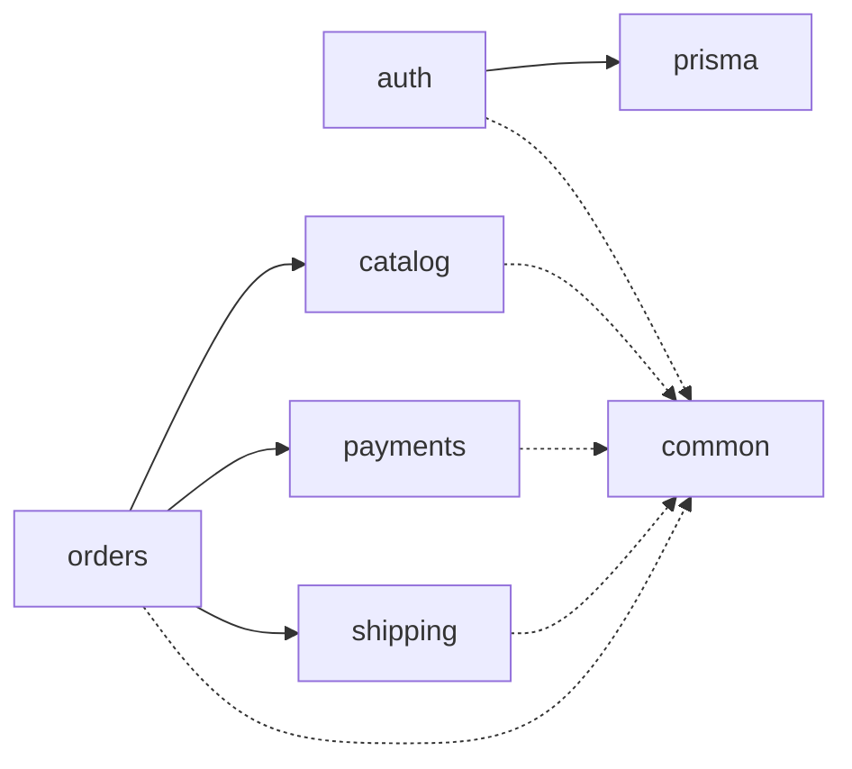

# Mapa de módulos internos

> Status: desenho-alvo. Reflete a estrutura de pastas sugerida em
> `claude/context.md`. Atualize conforme os módulos forem nascendo —
> se um módulo passar a depender de outro de um jeito não previsto
> aqui, o diagrama está desatualizado, não o código.

Setas sólidas = depende de (chamada direta via interface/serviço
injetado). Setas tracejadas = usa utilitário compartilhado, sem
acoplamento de domínio.

## Regras de dependência

- `orders` é o orquestrador: conhece `catalog` (checar produto/estoque),
  `payments` (cobrar) e `shipping` (calcular frete). Nenhum desses três
  conhece `orders` de volta.
- `catalog`, `payments` e `shipping` não se conhecem entre si.
- `auth` não depende de nenhum módulo de domínio. Os outros módulos
  usam `auth` só através de decorators (`@Public()`,
  `@RequirePermissions(...)`, `@CurrentUser()`), nunca importando
  serviços internos de `auth` diretamente — por isso não aparece como
  seta sólida saindo deles.
- `prisma` é infraestrutura, não domínio: expõe `PrismaService` como
  módulo global. `auth` depende dele de verdade (seta sólida) — lê
  usuário, papel e refresh token. Módulos de domínio vão depender dele
  do mesmo jeito conforme nascerem; ele não conhece ninguém de volta.
- `common` é via de mão única: qualquer módulo pode usar filtros/pipes/
  decorators de `common`, mas `common` nunca importa de um módulo de
  domínio.
- `payments` e `shipping` expõem só a interface (`PaymentProvider`,
  `ShippingProvider`); o adapter concreto (Stripe, transportadora X)
  fica escondido atrás dela — trocar de provedor não deve tocar em
  `orders`.

Quando isso for validado com lint (boundaries entre módulos), essa
seção diz o que a regra deve proibir.
