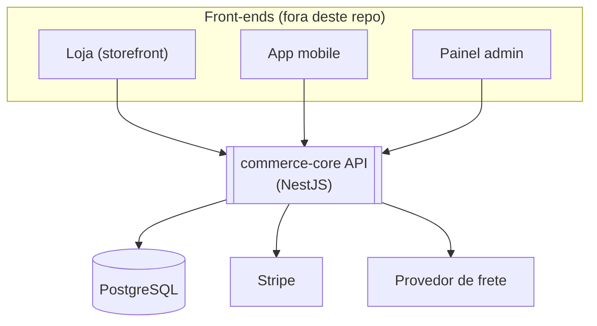

# Visão de contexto

> Status: real, menos o frete. `auth`, `catalog`, `orders` e `payments`
> existem, e a seta pro Stripe é código — inclusive na volta, que o
> diagrama não mostra: o Stripe chama `POST /payments/webhook` de volta
> pra confirmar pagamento e reembolso. O provedor de frete continua
> desenho-alvo. Atualize este diagrama assim que a realidade divergir dele.

`commerce-core` é o único core de API que qualquer front-end (loja, app
mobile, painel admin) consome. Ele não serve HTML nem tem UI própria.

## Decisões que aparecem neste diagrama

- **Um único core, múltiplos consumidores**: nenhum front-end tem lógica
  de domínio própria; tudo passa pela API.
- **Stripe e frete ficam atrás de interfaces próprias** (`PaymentProvider`,
  `ShippingProvider`) — o core depende de uma abstração, não do SDK do
  Stripe diretamente. Ver [`architecture/modules.md`](modules.md).
- Sem multi-tenancy, sem microsserviços na v1 (ver `claude/context.md`
  para o que fica fora de escopo).
